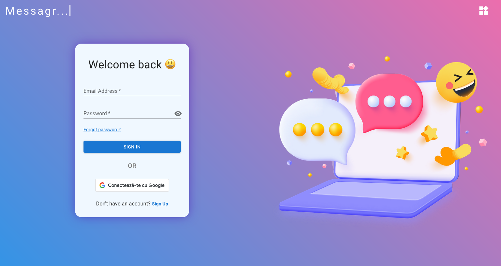
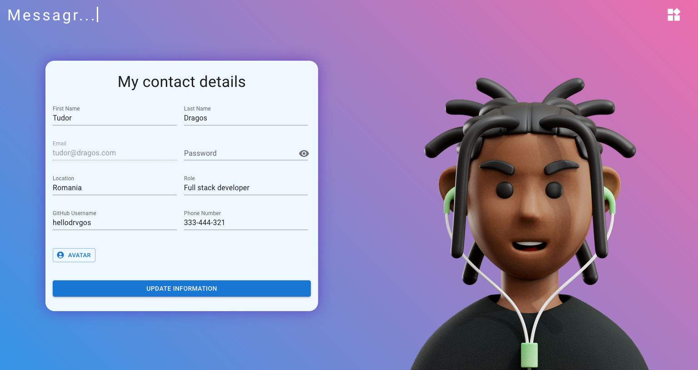
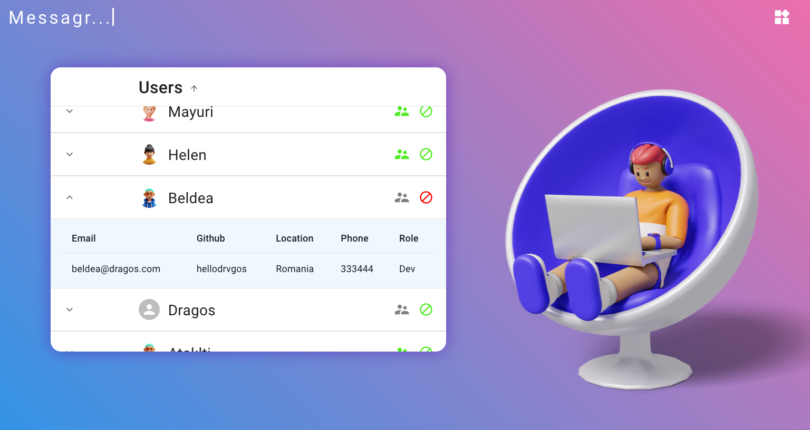
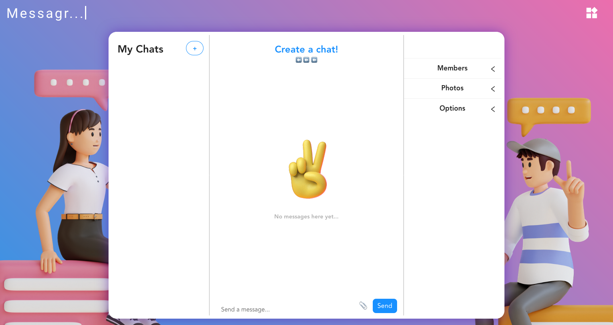

<!-- PROJECT LOGO -->

<h3 align="center">Messagr...</h3>
  

    "The one who sends a message"
     
  

<!-- TABLE OF CONTENTS -->

  
Table of Contents

  <ol>
    <li>
      <a href="#about-the-project">About The Project</a>
      <ul>
        <li><a href="#built-with">Built With</a></li>
      </ul>
    </li>
    <li><a href="#roadmap">Roadmap</a></li>
    <li><a href="#authors">Developers</a></li>
  </ol>

<!-- ABOUT THE PROJECT -->
## About The Project

This project was focused on creating a Full-stack application that included a user authentication system with the option to log in using Google or a password. The application also featured an Admin feature, which enabled the Admin to view the list of all users, promote a regular user to Admin, or ban a user. The application also included a log-out feature for users to safely end their sessions.

### Built With

* [![HTML5][HTML5]]
* [![CSS3][CSS3]]
* [![TypeScript][TypeScript]]
* [![Material-UI][Material-UI]]
* [![React][React.js]]
* [![Redux][Redux]]
* [![React Router][React Router]]
* [![Node.js][Node.js]]
* [![Express.js][Express.js]]
* [![MongoDB][MongoDB]]

(<a href="#readme-top">back to top</a>)

<!-- ROADMAP -->
## Roadmap

- [ ] The user can register/login with Google or password
- [ ] The user can reset password
- [ ] The user can logout
- [ ] The user can update information
- [ ] Admin can promote other user to Admin
- [ ] Admin can ban other user
- [ ] The user can chat with other users. API provided by [Chat Engine]

(<a href="#readme-top">back to top</a>)

<!-- AUTHORS -->
## Developers:

* [Helen]
* [Mayuri]
* [Ataklti]
* [Dragos]

(<a href="#readme-top">back to top</a>)

<!-- MARKDOWN LINKS & IMAGES -->
<!-- https://www.markdownguide.org/basic-syntax/#reference-style-links -->
[HTML5]: https://img.shields.io/badge/HTML-239120?style=for-the-badge&logo=html5&logoColor=white
[CSS3]: https://img.shields.io/badge/CSS-239120?&style=for-the-badge&logo=css3&logoColor=white
[TypeScript]: https://img.shields.io/badge/TypeScript-007ACC?style=for-the-badge&logo=typescript&logoColor=white
[Material-UI]: https://img.shields.io/badge/Material--UI-0081CB?style=for-the-badge&logo=material-ui&logoColor=white
[React.js]: https://img.shields.io/badge/React-20232A?style=for-the-badge&logo=react&logoColor=61DAFB
[Redux]: https://img.shields.io/badge/Redux-593D88?style=for-the-badge&logo=redux&logoColor=white
[React Router]: https://img.shields.io/badge/React_Router-CA4245?style=for-the-badge&logo=react-router&logoColor=white
[Node.js]: https://img.shields.io/badge/Node.js-43853D?style=for-the-badge&logo=node.js&logoColor=white
[Express.js]: https://img.shields.io/badge/Express.js-404D59?style=for-the-badge
[MongoDB]: https://img.shields.io/badge/MongoDB-4EA94B?style=for-the-badge&logo=mongodb&logoColor=white

[Chat Engine]: https://chatengine.io/
[Helen]: https://github.com/helena-hub1
[Mayuri]: https://github.com/mayuri2018
[Ataklti]: https://github.com/B324W17
[Dragos]: https://github.com/hellodrvgos
